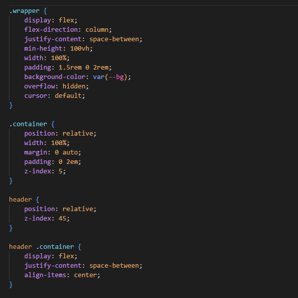

---
<!--LOGO-->

    

# 
Twilight Dusk
 #

--- 
<!--CHANGELOG-->

### 
Changelog
 ###

##### 
Version 1.2.0
 #####

- 
added logo to extension

- 
adjusted logo size

---
<!--IMAGE PREVIEW-->

### 
Images
 ###

#### 
HTML
 ####

    

#### 
CSS
 ####

    

#### 
JavaScript
 ####

    

---
<!--INSTRUCTIONS-->

### 
Installation
 ###

- Open the Extensions in Visual Studio Code ( Ctrl + Shift + X ) for Windows / Linux & ( ⇧ + ⌘ + X ) for Mac

- Type __Twilight Dusk__ in the search box

- Click Install

- Go to File / Preferences / Color Theme / Dark Twilight Theme

- That's it, leave a 5:star: rating if you like the theme & thanks for checking it out

---
<!--Extras instructions-->

### 
Extras
 ###

You can also customise the color of your brackets :

 

 

- Press ( Ctrl + Shift + P ) on Windows / Linux & for Mac press ( ⇧ ⌘ P , F1 )

- Type in __settings.json__

- Click on Preferences: Open Settings(JSON)

- Input what you see in the image above, or customize the colors to your own liking.

---

<!--Suggestions-->

### 
Feedback
 ###

If you have any issues or would like to leave some feedback, here is a link to my [GitHub](https://github.com/Glitch-Code-Design/Twilight-Dusk-VS-Code-Theme/issues 'Github').
